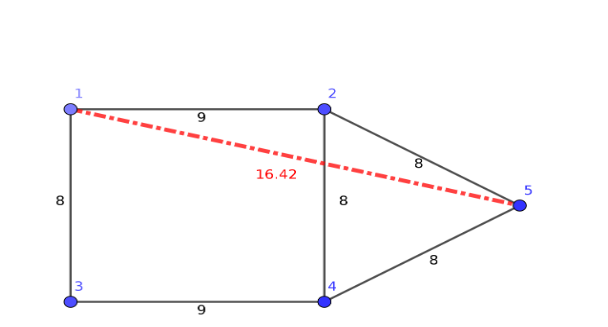
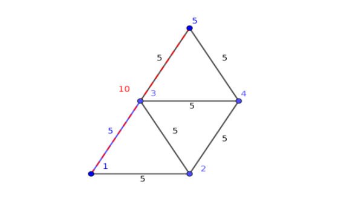

PlaceFinderMarks: 100
Problem Description
The Place Finder is a special tool made for finding locations in areas without internet. To know where you are, you need a group of these devices because they work together. These devices can easily talk to each other.

Each device can find where other devices are and how far they are. This information is shared among devices, creating a network. This network helps with communication and figuring out where devices are in relation to each other. To make the system more accurate, all devices in the network sync up and point in the same direction.

In a real time scenario , each devices is able to communicate with each other, but it is not able to find the direction and distances of all devices due to natural obstacles. However for few devices it may be possible to know their direction and distances. Now Your job is to find how far apart two specific devices are, in this connected network. Each device has a unique ID for easy communication and identification.

The calculations required to find distance between devices can be understood from the through the Examples section

Constraints
1 < N < 16

Angle is measured in degree.

Distance is in meters

Input
First line consists of an Integer 'N' denoting total number of place finder devices

Second line consist of 'N' pairs of space separated integers. Each pair is separated by a colon. First value of the pair represents the device ID, second value represents the number of devices that can be found by this device.

Next lines consist of "N" logical sections. Each logical section consists of

Device ID as its First line,
Followed as many number of lines as devices that can be found by this device. Each such lines has three space separated Integers denoting "Device ID", " Distance" and "Angle".
Last line consists of two space separated integers representing Id of devices between whom we have to find the distance .

Output
Print the Distance rounded off to two decimal points denoting the distance between the given two devices

Time Limit (secs)
1

Examples
Input

5

1:2 2:3 3:2 4:3 5:2

1

2 9 0

3 8 270

2

5 8 330

4 8 270

1 9 180

3

1 8 90

4 9 0

4

2 8 90

3 9 180

5 8 30

5

2 8 150

4 8 210

1 5

Output

16.42

Explanation

The first line describes there are totally five devices

The second line describes that the device "1" is able to find the direction and distance of 2 devices and device "2" is able to find the direction and distance of 3 devices and so on.

From the third line Individual logical section starts
From the first line of this logical section, we say it is the data from device "1"

From second line of this logical section, device "2" is located at distance of 9 m from the device "1" at the angle of 0 degree.

From third line of the logical section, device "3" is located at distance of 8 m from the device "1" at an angle of 270 degree.

The above diagram describes the first logical section.

By continuing similarly for all the logical sections, we can visualize the network. Below figure depicts the network

Now when we measure the distance between the device "1" and device "5" we get the output as 16.42.

Example 2

Input

5

1:2 2:3 3:4 4:3 5:2

1

2 5 0

3 5 60

2

1 5 180

3 5 120

4 5 60

3

2 5 300

4 5 0

5 5 60

1 5 240

4

2 5 240

3 5 180

5 5 120

5

3 5 240

4 5 300

1 5

Output

10.00

Explanation

Above diagram depicts the network. The distance between the device "1" and device "5" are 10.

Hence the output 10.00.

